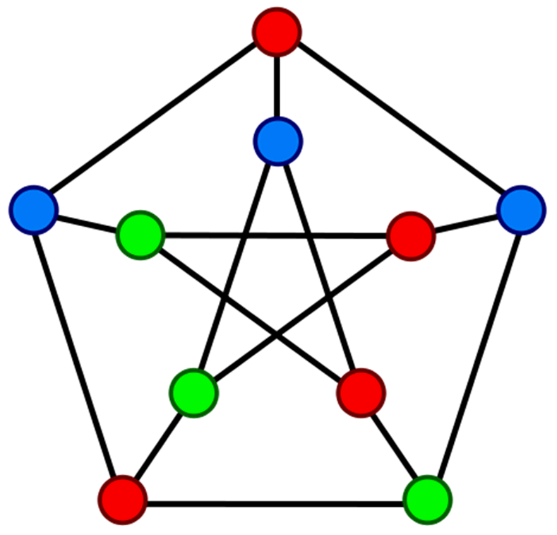
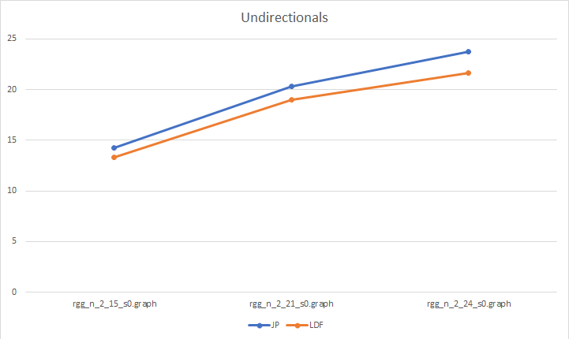
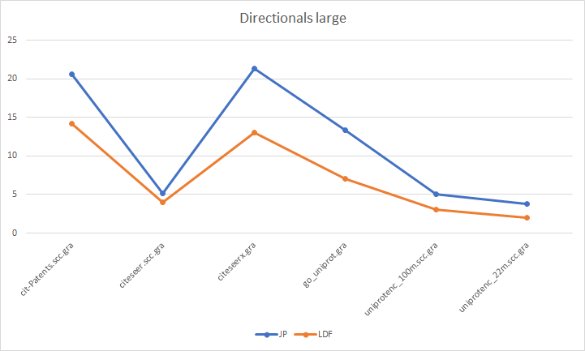
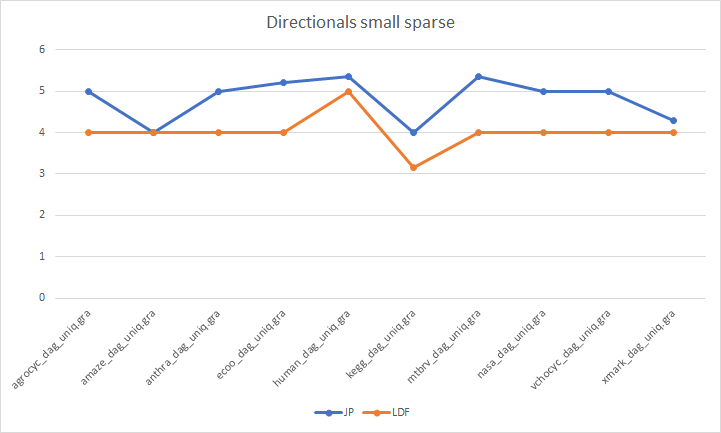
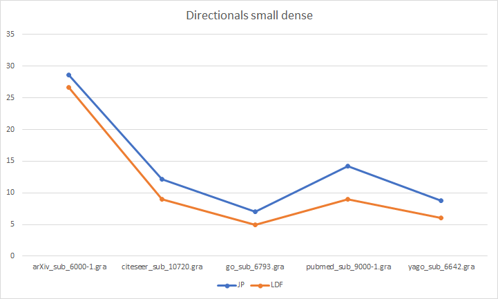

<!-- PROJECT LOGO -->
<br />
<h3 align="center">Politecnico di Torino</h3>
<h3 align="center">System and device programming</h3>
<h3 align="center">Academic year 2020-2021</h3>
<h4 align="center">Team members: Cardano Filippo, Finocchiaro Loredana, Gagliardi Giuseppe</h3><br />
<p align="center">
  <a href="https://github.com/Frititati/GraphColoringQ1">
    
  </a>

  <h1 align="center">Q1: Parallel Graph Coloring</h1>

  <p align="center">
    In graph theory, graph coloring is a special case of graph labeling; in which particular labels, traditionally called “colors”, are assigned to elements of a graph subject to certain constraints.
    <br /> In its simplest form, it is a way of coloring the vertices of a graph such that no two adjacent vertices are of the same color. Graph coloring enjoys many practical applications as well as theoretical challenges. Many graph applications are based on vertex coloring and many graph properties are based on graph coloring. Moreover, vertex coloring is the most famous version of coloring since other coloring problems can be transformed into a vertex coloring instance.
    <br /><br />
    <a href="https://github.com/Frititati/GraphColoringQ1"><strong>Explore the docs »</strong></a>
    <br />
    <br />
  </p>
</p>


<!-- TABLE OF CONTENTS -->
<details open="open">
  <summary><h2 style="display: inline-block">Table of Contents</h2></summary>

- [Abstract](#abstract)
- [Folders organization](#folders-organization)
- [Program execution](#program-execution)
  + [Sequential](#sequential)
  + [Parallel](#parallel)
  + [Tester](#tester)
- [Development Details](#development-details)
  + [Jones-Plassman (JP)](#jones-plassman-jp)
    + [JP Reading phase](#jp-reading-phase)
    + [JP Coloring phase](#jp-coloring-phase)
    + [JP Writing phase](#jp-writing-phase)
  + [Largest Degree First (LDF)](#largest-degree-first-ldf)
    + [LDF Reading phase](#ldf-reading-phase)
    + [LDF Coloring phase](#ldf-coloring-phase)
    + [LDF Writing phase](#ldf-writing-phase)
- [Development Philosophy](#development-philosophy)
  + [Sequential Optimization Jones-Plassman](#sequential-optimization-jones-plassman)
  + [Sequential Spin-Off](#sequential-spin-off)
  + [Parallel Optimization Jones-Plassman](#parallel-optimization-jones-plassman)
    + [Coloring Optimization](#coloring-optimization)
    + [Reading Optimization](#reading-optimization)
  + [Jones-Plassman Improved Datastructures](#jones-plassman-improved-datastructures)
- [Performance tests](#performance-tests)
  + [Sequentials](#sequentials)
    + [JP sequential](#jp-sequential)
    + [LDF sequential](#ldf-sequential)
  + [Parallels](#parallels)
    + [JP parallel](#jp-parallel)
    + [LDF parallel](#ldf-parallel)
  + [Others](#others)
    + [JP Sequential Spin-Off](#jp-sequential-spin-off)
    + [JP Parallel (improved datastructures)](#jp-parallel-improved-datastructures)
  + [Usage of colors](#usage-of-colors)
- [Conclusions](#conclusions)
- [References](#references)

</details>
<br />

# Abstract

This document aims to present and discuss in detail the project _Q1: Parallel Graph Coloring_ related to the System and device programming course, taught by professor Quer.<br />
We'll start by indicating the folders organization and providing the commands necessary to compile and run the submitted programs, then we'll go deep in each of them in order to describe and motivate our approach and choices. Finally, we'll show and compare data obtained from the performance testing we carried out, and draw conclusions from them.<br />
We remind that all the source files that we provided have been developed in **C++11** language and executed in a **UNIX** environment.<br />
Here below you can find the basic details related to the three members of the team:

- Cardano Filippo Maria, 292113;
- Finocchiaro Loredana, 269731;
- Gagliardi Giuseppe, 286286.

<br />

# Folders Organization

In the main folder of the project, you can find two different subfolders:

- **Officials**, that contains all the complete and definitive versions of the algorithms, divided again in subfolders: Sequentials, Parallels and Tester.
- **Others**, where we put some attempts of optimization (even though not totally satisfactory, for different reasons), together with the original .csv files used for conducting performance testing.

<br />

# Program Execution

The solutions that we’ve developed so far are compatible to work both with DIMACS and DIMACS10 graph formats that have been provided.
The algorithms we decided to implement are the Jones-Plassman and the Largest Degree First. You can find both sequential and parallel versions of them.

Here below the command (and link) for cloning the GitHub repository:
   ```sh
   git clone https://github.com/Frititati/GraphColoringQ1
   ```

Note that the repository was used during the development of the project, therefore there are more folders and executables with respects to the .zip file.

## Sequential

In the folder Sequential, it is possible to find the sequential versions of both Jones-Plassman and LDF coloring algorithms. Input parameters are the name of the graph file and (optionally) the name of the output file, where all the colors assigned to each node, one per line, will be printed.<br />
Both can be compiled and executed by issuing the following commands:<br />
   ```sh
   g++ file_name.cpp -o executable_name

   ./executable_name <graphFile> [<outputFile>]
   ```

## Parallel

In the folder Parallel, there are multithreaded versions of both Jones-Plassman and LDF coloring algorithms. Input parameters are the name of the graph file, the number of threads and (optionally) the name of the output file.<br />
Both can be compiled and executed by issuing the following commands:<br />
   ```sh
   g++ file_name.cpp -o executable_name -pthread -std=c++11

   ./executable_name <graphFile> <threadNum> [<outputFile>]
   ```

## Tester

In the folder GraphTest, there is a simple program, developed by ourselves, too, that checks if the output produced either by Jones-Plassman or LDF algorithm is correct with respect to the input graph file. Input parameters are the name of the graph file and the name of the output file. Basically, it verifies if there is any node that has a neighbor node colored with the same color that has been assigned to itself. In that case, it will finally print on the stdout not only the total number of error that it encountered during the scan, but also the specific nodes (and colors) involved in the errors.<br />
Such a program revealed to be really useful during the implementation phase of our solutions, and can be compiled and executed by issuing the following commands:<br />
   ```sh
   g++ file_name.cpp -o tester

   ./tester <graphFile> <outputFile>
   ```
<br />

# Development Details

## Jones-Plassman (JP)

This algorithm improves upon the MIS algorithm, which creates a new random permutation of the nodes every time an independent set needs to be calculated. Jones-Plassman, instead, constructs a single set of unique random weights at the beginning and uses it through-out the coloring algorithm. This can easily be done by assigning random numbers to each of the vertices and using the unique vertex index to resolve a conflict in the unlikely event of neighboring vertices getting the same random number. Nodes are then colored individually using the smallest available color.

### JP Reading Phase

In the **sequential** version of the algorithm, the main thread, after checking the correctness of the input parameters, opens the graph file, verifies the format (directional/undirectional) and then starts parsing it. Each line is split and related data is stored in a global std::map, named `node_edge_connections`, where the key, of type integer, corresponds to the index of the node described in that line, while the value is a std::vector of integers that contains, one by one, all the nodes the examined node is connected to.<br />
Other global data structures used not only in this particular phase but also during the whole execution of the program are two vectors of integers: `node_random` that will store the random numbers assigned to each node, and `node_color` used for memorizing the colors that each node will be colored with.<br />
In the same loop used for the file parsing, at each iteration, a new random number (in the range 1 and 100) is generated and pushed back to the `node_random` vector; at the same time, a zero is pushed back to the `node_color` vector (as the algorithm says, we need to initialize each node with the color 0, that basically means “no color”).<br />
In case the graph is directional, there is one more step where missing connections are added to the global map, basically aiming to obtain the same result of an undirectional graph.

In the **parallel** version of the algorithm, the reading phase has been parallelized as well as the coloring one. In this case, the initialization of the two global vectors `node_random` and `node_color` is done by the main thread; after that, threads are created.<br />
It is possible to invoke two different reading functions depending on the format of the graph file, that is still verified by the main thread before launching the others. So each thread opens independently the file, since each one has to read a different part of it at the same time. The number of lines to be parsed and the position from which the reading has to start is computed starting from the unique ID that has been assigned to each thread during the creation phase; then, everything proceeds as described in the sequential version, except for the usage of the global `node_edge_connections` map, that is still needed during the reading phase in case the format of the graph is directional (in the undirectional case, each thread populates directly its local `node_assigned` map, that will be used during the coloring phase).<br />
From a synchronization point of view, a barrier is needed at the end of the reading phase and before proceeding with the coloring one only in case the format of the graph is directional.

### JP Coloring Phase

The coloring phase consists of a while loop that can be divided in two different sections.
In the first section of the **sequential** version, we start iterating over the `node_edge_connections` map and, for each of the examined nodes, we iterate over all its connections and compare the examined node with its connected nodes: if the connected node has already been colored, we store its color in the std::set `colors_used_local`, otherwise we check if the random number associated to it (connected node) is higher or lower than the random number of the examined node, in order to determine if the examined node is the highest or not (in case of conflicts, we take in consideration the respective indexes of the nodes). In case the node is the highest one, we store its key and color to be assigned in the `to_be_evaluated` map, that will be used later on during the second section. It’s interesting to note that the color to be assigned to the highest node is chosen by taking the first (and lowest) color from the set derived from the difference between two sets (`colors_used_global` and `colors_used_local`); this operation is done directly by leveraging the set_difference function.<br />
After all the nodes of the `node_edge_connections` map have been analyzed, the second section starts. We iterate over the `to_be_evaluated` map and perform two actions for each node:

- Memorize the color that has been assigned to it in the `node_color` vector;
- Remove that node from the `node_edge_connections` map.

In case we’ve colored at least one node with the highest color being in the set `colors_used_global`, we need to add a new color to this set before proceeding with the next iteration of the while loop. The algorithm finishes when all the nodes of the graph have been colored (i.e., until the `node_edge_connections` map becomes totally empty).

There are basically two main differences between the sequential version and the parallel one.

- In the multithreaded environment, each thread iterates over its own local map of nodes and connections, that is a portion of the global `node_edge_connections` map used in the sequential case.
- Since threads need to access global resources both for reading and writing (such as the `node_color` vector) at the same time, synchronization strategies have become fundamental. We chose to insert two barriers (implemented opportunely by using a mutex, a condition variable and a counter): the first one is put between the first and the second section of the coloring phase (before writing to the `node_color` vector, it is necessary that all the threads have finished iterating over their local map), the second one, instead, is put at the end of the second section (before proceeding with the next iteration, it is necessary to verify if there are threads that, having finished coloring their map, are going to exit, and update accordingly the number of threads that are still working).

### JP Writing Phase

Writing phase is exactly the same in both **sequential** and **parallel** versions. Basically, it consists in producing an output file where the resulting `node_color` vector is printed in order, one color per line.</br>
This part of the algorithm was not parallelized, as test showed it did not provide any benefits.

```c++
string final = to_string(number_nodes) + " " + to_string(number_edges) + "\n";
int max_color = 0;

for (auto i: node_color) {
  final += to_string(i) + "\n";
  if (i > max_color) {
    max_color = i;
  }
}

auto output_file = std::fstream(argv[3], std::ios::out | std::ios::binary);
output_file.write(final.c_str(), (final.size() * sizeof(char)));
output_file.close();
```
To begin, we initialize `final` std::string to display the number of nodes and edges. After that, we loop over the `node_color` vector where all colors from the coloring algorithm are stored. Within the loop, we construct `final` to add the color of each node. Finally we open a std::fstream `output_file` to which we write the entire content of `final`, and then we close it.

<br />

## Largest Degree First (LDF)

The Largest Degree First algorithm can be considered as an optimization of the Jones-Plassman: differently from Jones-Plassman, it first looks at the degree (i.e. number of connections) of each node, and starts coloring nodes in order of decreasing degree; random numbers are still used in order to avoid possible conflicts that may arise in case we compare nodes that have exactly the same degree.<br />
Since LDF implementation started from Jones-Plassman one, the structure of both sequential and parallel versions is practically the same. We’ll report in detail the main differences in the next paragraphs.

### LDF Reading Phase

LDF algorithm required the definition of a new global data structure, `node_degree`: similarly to `node_color` and `node_random`, it is a vector of integers where the degree of each node is stored. It is filled during the reading phase by simply taking the size of the vector of connections that is inserted as value part in the (global or local, depending on the version and on the graph format) map that contains the index of the node as key.<br />
From a synchronization point of view, a barrier is needed at the end of the reading phase and before proceeding with the coloring one, independently of the graph file format.

### LDF Coloring Phase

The coloring phase of the LDF algorithm differs from the Jones-Plassman one only for the condition for determining if the examined node is the highest or not: indeed, before looking at random numbers, we first check if the degree of the examined node is higher or lower with respect to the degree of the connected nodes; in case the two compared degrees are identical, we need to consider random numbers and, in the eventual case of another coincidence, also the node key.

### LDF Writing Phase

The writing phase coincides exactly with that related to the Jones-Plassman algorithm, described in detail in the corresponded paragraph of the previous section.

# Development Philosophy

To begin the development of the project, we prepared small achievable objectives in incrementing complexity. The goal was to set up a good basis, such that development would not be unstructured or messy. For example, we developed a file parser for the DIMACS and DIMACS10 formats, the basic data structure to store node-data, and a graph tester, such that any algorithm we would end up developing could be tested, in order to be sure that it colored graphs correctly. Furthermore, after the base structure was completed, we focused solely on implementing the algorithm. We began with a sequential unoptimized approach of the Jones-Plassman algorithm following the related literature, this was to get familiarized with the algorithm. The graph tester was handy, as many of the initial outputs seemed to be correct but actually produced wrongful results. After a fully working first version of the Jones-Plassman sequential algorithm, only at that point we looked towards optimizing it.

## Sequential Optimization Jones-Plassman

The approach we took when optimizing always began with looking at the loops the algorithm had to accomplish during its execution. We attempted to reduce these occurrences or place multiple functions in the same loop (to avoid repeating them); this was not necessarily the case with the first optimization of the Jones-Plassman sequential, however, this didn't discourage us from looking at other potential improvements. Then we looked at the various data structures present in the algorithm, in our experience this approach yielded better result. For example, the first data structures we utilized (present in the std namespace) is the **std::set**. This not only provided a better data structure, but also rendered the code simpler, especially within the iterative step.

```c++
if (is_highest)
{
  std::set<int> colors_used_iteration;
  std::set_difference(colors_used_global.begin(), colors_used_global.end(), colors_used_local.begin(), colors_used_local.end(), std::inserter(colors_used_iteration, colors_used_iteration.end()));
  auto choosen = colors_used_iteration.begin();
  to_be_evaluated.insert(std::pair<int, int>(node_key_this, *choosen));
}
```
This code snippet is taken from **'sequential_second_attempt.cpp'**. This is at the end of the iterative step for a node, which the algorithm has recognized as the highest in its local area, this is denoted by the `is_highest` boolean. In the 3<sup>rd</sup>-5<sup>th</sup> line we use 3 different **std::set**: `colors_used_iteration` is the set where the smallest (first index) available color is selected, `colors_used_global` is the set where all available colors are present, `colors_used_local` is the set of all colors this node cannot be colored (as they belong to adjacent nodes). Here the **std::set** comes in very useful as the built-in function `set_difference` is not only faster of possible custom loops but also sorts the possible colors which means we can always take the first of the list in the following operation. Here is a list of reasons why we switched from **std::vector** to **std::set**:
- **std::set** is a data structure that only keeps unique values, this is useful as we used it primarily for colors which don't need to be counted, also if we were to try to insert the same color twice it would simply not add it without returning an error.
- **std::set** are sorted such that when using colors we can always take the smallest available (first index).
- **std::set** has the set_difference built-in function which compares 2 sets and outputs another sorted set with the difference between the two input sets.

## Sequential Spin-Off

During the optimization described in the last step we also realized another potential area where there were overheads in processing was the selection of the color. We ask whether assigning different colors to all nodes in the same iterative step was less efficient than assigning the same color to all nodes (at the same time). This turned out to be true and suggested a potential optimization. However, it is important to mention that by doing so we are not following the Jones-Plassman algorithm anymore. This new algorithm focuses on improving the execution time disregarding completely the number of colors used. Here are the main difference between the classical approach (Jones-Plassman) **'sequential_second_attempt.cpp'** to the new algorithm **'sequential_second_spinoff_attempt.cpp'**:

- Nodes are colored all together (the same color) at the end of the iterative step, this differs from the classical approach where nodes are colored differently at the end of the iterative step.
- Instead of using **std::set** as mentioned previously we use **std::vector** to keep all colors these nodes cannot be colored (as they belong to adjacent nodes).
- The `is_highest` if condition is simplified.

To conclude, we did not deliver a parallelized version of this new algorithm, as it had two fatal flaws. The first reason was that the parallelized version would not have the same benefits as the sequential one. The second reason was that it used too many colors, it was against our objective to pursue an algorithm that would use the least colors possible.

## Parallel Optimization Jones-Plassman

### Coloring Optimization

Following the extensive optimization from the sequential algorithm for Jones-Plassman, we had a clear direction to follow in the parallelized version of the algorithm. Initially, our objective was to simply take the structure we developed in the sequential version and push it to work with a couple of threads (2-3 initially). The reading phase (first part) and writing phase (last part) were untouched, we just wanted to focus solely on the parallelization of the algorithm to avoid adding multiple complex operations at the same time. This was accomplished using some **std::map** splitters and some custom-made barriers using **std::mutex**, were the spitters took the reading phase **std::map** and split it according to how many threads we had, whereas the **std::mutex** and **std::condition_variable** were used to synchronize the threads in a barrier-like fashion. We recognized that the **std::vector** (specifically in this case `node_color`) is thread-safe if all threads are solely reading (no one can write), and is also thread-safe if threads are all writing at the same time (no one can read) but on different sectors (no overlaps in writing). This meant that we had to create barriers-like functions which would enable threads to only read or only write (their specified sector).

```c++
void wait_single(int name) {
  // get lock
  std::unique_lock < std::mutex > lck(barrier_mutex);
  // lower barrier counter
  barrier_counter--;
  // if the barrier_counter is 0 means we are the last thread
  // reset variable for next barrier
  if (barrier_counter == 0) {
    // fix number_threads to adjust for exited threads
    barrier_counter = number_threads;
    barrier_cv.notify_all();
    // leave without going to the condition wait
    return;
  }
  barrier_cv.wait(lck);
}
```
Here is an example of a barrier-like function. There are lots of variables, here is a short description:
- `barrier_mutex` is a mutex used to give exclusive read-write of barrier_counter.
- `barrier_counter` is an integer (initialized to the number of available threads) used to count the number of threads which already entered this function
- `number_threads` is an integer is the number of alive threads currently.
- `barrier_cv` is a condition_variable used to notify threads waiting.
- `lck` is a unique_lock used to lock `barrier_mutex`, useful as it is destroyed when it leaves the scope.

There are 2 different paths a thread can take when entering this function:
1. Thread enters, receives the lock, reduces the `barrier_counter` by 1, `barrier_counter` is not 0, therefore it ends up in the last lines where it waits to be notified, the `barrier_cv.wait(lck)` releases the `lck` therefore another thread can enter the function.
2. Thread enters, receives the lock, reduces the `barrier_counter` by 1, `barrier_counter` is equal to 0, therefore it is guaranteed that it's the last thread to enter, it resets `barrier_counter` to the `number_threads` for another possible barrier later on in the code, it notifies all waiting threads in (#1), returns to avoid entering the wait condition (`barrier_cv.wait(lck)`).  

### Reading Optimization

Optimizing the reading phase was the second objective after the coloring algorithm was successfully parallelized. Using the structure of the input graphs, the first line always tells us how many vertices (nodes) are to be expected in the graph, so we can calculate which sector each thread should read of the input graph and then we can have the reading done independently by each thread. Unfortunately, performance varies as the undirectional types of graph generally have a greater advantage to the directional ones, because we need to still synchronize the data on all threads if the graph is directional (place it in a global data structure `node_edge_connections`), this is not required with the undirectional graphs.
It's also important to mention that with the directional type of graphs we need another barrier after the synchronization of the `node_edge_connections` whereas with the undirectional type of graphs we can simply start the execution of the coloring algorithm.

## Jones-Plassman Improved Datastructures

Another avenue we looked into when developing the parallelized version of the algorithm was to change the base data structures. We initially focused on the data structures where the nodes calculated data would be stored, these are `node_color` and `node_random`, however there wasn't much to be done, as the **std::vector** library is already very perfomant and any changes we attempted didn't yield any leaps in performance. We also looked at the the data structure that kept node data (usually called `node_edge_connections`), this was an **std::map** with an index (int) and **std::vector** within it to store all connected nodes. Our attempt was too see whether a **struct** especially made could perform better, it did.
```c++
struct node_struct {
  int index;
  int size;
  int * connections;
};
```
`node_struct` has three fields, an `index` to identify the node, a `size` to describe how many `connections` are present. We needed an array of `node_struct` to fully replace the **std::map** that was present before, so this changed the reading and coloring phases of the algorithm. Also, with an array of `node_struct` (`node_assigned`) we couldn't use iterators anymore, so we needed to create a complementary **std::set** (`nodes_iteration`) which we could exploit for the iterators and the ability to easily delete indexes without having to rewrite the array. This was all crucial to maintain the core algorithm the same as before but with an array instead of **std::map**.<br>
This algorithm proved to perform better than its predecessor, seeing improvements in the reading and coloring phases in terms of execution times (see below in Performance tests). However, it suffers a big flaw, it is only good with undirectional graphs, as the directional graphs require a synchronization of all the `node_assigned` arrays, this would remove all benefits of this solution.

# Performance Tests

Performance testing were all executed on a Windows Subsystem Linux machine with the following characteristics:<br />
- AMD Ryzen 1700 8-Core (16 Threads) CPU (~3.5GHz);
- 32GB 3200MHz RAM;
- SSD Kingston 256GB (where tests were run);
- Turned off most other programs running.

Memory usage was estimated with the tool **runlim**, while execution times, measured in microseconds, were calculated with **std::chrono::steady_clock**.<br />
Timings for executing each section of each program for each graph were reported as an average of values obtained from five different executions; for the number of used colors, we decided to report min and max values instead of the average.<br />
Tables were grouped first by version of the program (sequential or parallel), then by type of the algorithm (JP or LDF); furthermore, directional graphs are divided by category (large, small sparse, small dense).


## Sequentials

### JP Sequential

#### **Undirectional**

|              | rgg_n_2_15_s0.graph | rgg_n_2_21_s0.graph | rgg_n_2_24_s0.graph |
|:------------:|:-------------------:|:-------------------:|:-------------------:|
| **number nodes** |        32768        |       2097152       |       16777216      |
| **number edges** |        160240       |       14487995      |      132557200      |
| **number color** |        14-15        |        19-21        |        23-24        |
|    **memory**    |        6.4 MB       |       336.6 MB      |       2764.3 MB       |
|     **read**     |        125397       |       9602881       |       84251876      |
|     **algo**     |        282090       |       28286935      |      266413684      |
|    **writing**   |         9211        |        889542       |       7468202       |
|  **total time**  |        416698       |       38779358      |      358133763      |

<br />

#### **Directional: large**

|              | cit-Patents.scc.gra | citeseer.scc.gra | citeseerx.gra | go_uniprot.gra | uniprotenc_100m.scc.gra | uniprotenc_22m.scc.gra |
|:------------:|:-------------------:|:----------------:|:-------------:|:--------------:|:-----------------------:|:----------------------:|
| **number nodes** |       3774768       |      693947      |    6540401    |     6967956    |         16087295        |         1595444        |
| **number edges** |       33037894      |      624564      |    30022520   |    69540470    |         32174586        |         3190884        |
| **number color** |        20-21        |        5-5       |     21-21     |      12-15     |           5-5           |           4-4          |
|    **memory**    |      1299.4 MB      |     135.3 MB     |    2467.1 MB    |     1928.5 MB    |         3726.2 MB         |        375.0 MB        |
|     **read**     |       43973800      |      3820899     |    60579110   |    48924881    |         59555278        |         5385536        |
|     **algo**     |       95819003      |      2374545     |   119437932   |    273024478   |         75021295        |         5990443        |
|    **writing**   |        647713       |      128279      |    1091879    |     1200987    |         2742549         |         366801         |
|  **total time**  |      140440517      |      6323723     |   181108922   |    323150348   |        137319123        |        11742781        |

<br />

#### **Directional: small sparse**

|              | agrocyc_dag_uniq.gra | amaze_dag_uniq.gra | anthra_dag_uniq.gra | ecoo_dag_uniq.gra | human_dag_uniq.gra | kegg_dag_uniq.gra | mtbrv_dag_uniq.gra | nasa_dag_uniq.gra | vchocyc_dag_uniq.gra | xmark_dag_uniq.gra |
|:------------:|:--------------------:|:------------------:|:-------------------:|:-----------------:|:------------------:|:-----------------:|:------------------:|:-----------------:|:--------------------:|:------------------:|
| **number nodes** |         12684        |        3710        |        12499        |       12620       |        38811       |        3617       |        9602        |        5605       |         9491         |        6080        |
| **number edges** |         27314        |        7894        |        26654        |       27150       |        79632       |        8790       |        20876       |       13076       |         20690        |        14102       |
| **number color** |          6-6         |         4-4        |         5-5         |        5-6        |         5-6        |        4-4        |         5-6        |        5-5        |          5-5         |         4-4        |
|    **memory**    |        4.5 MB        |       <0.1 MB      |        4.4 MB       |       4.3 MB      |       15.0 MB      |      <0.1 MB      |       5.4 MB       |      <0.1 MB      |        5.3 MB        |       5.2 MB       |
|     **read**     |         90914        |        20250       |        93953        |       94614       |       285235       |       19498       |        67747       |       34123       |         65951        |        35524       |
|     **algo**     |         37457        |        12555       |        44343        |       40887       |       131512       |       13278       |        29727       |       18731       |         30467        |        21425       |
|    **writing**   |         2653         |        1146        |         2816        |        2649       |        7640        |        1114       |        2061        |        1689       |         2002         |        1474        |
|  **total time**  |        131024        |        33952       |        141112       |       138150      |       424388       |       33891       |        99536       |       54544       |         98421        |        58424       |54544            |98421               |58424             |

<br />

#### **Directional: small dense**

|              | arXiv_sub_6000-1.gra | citeseer_sub_10720.gra | go_sub_6793.gra | pubmed_sub_9000-1.gra | yago_sub_6642.gra |
|:------------:|:--------------------:|:----------------------:|:---------------:|:---------------------:|:-----------------:|
| **number nodes** |         6000         |          10720         |       6793      |          9000         |        6642       |
| **number edges** |        133414        |          88516         |      26722      |         80056         |       84784       |
| **number color** |         29-29        |          11-13         |       7-7       |         14-14         |        9-9        |
|    **memory**    |        6.4 MB        |         7.0 MB         |      5.4 MB     |         6.3 MB        |       5.8 MB      |
|     **read**     |         61620        |          71014         |      42716      |         74485         |       43957       |
|     **algo**     |        206276        |          99761         |      30138      |         120466        |       90579       |
|    **writing**   |         1542         |          2604          |       1962      |          2040         |        1551       |
|  **total time**  |        269439        |         173380         |      74816      |         196992        |       136089      |

<br />

### LDF Sequential

#### **Undirectional**

|              | rgg_n_2_15_s0.graph | rgg_n_2_21_s0.graph | rgg_n_2_24_s0.graph |   
|:------------:|:-------------------:|:-------------------:|:-------------------:|
| **number nodes** |        32768        |       2097152       |       16777216      |   
| **number edges** |        160240       |       14487995      |      132557200      |   
| **number color** |        13-14        |        19-19        |        21-22        |   
|    **memory**    |        6.4 MB       |       340.8 MB      |       2764.3 MB     |   
|     **read**     |        128243       |       9819794       |       85910028      |   
|     **algo**     |        405716       |       42331148      |      405081845      |   
|    **writing**   |         8519        |        916262       |       6729962       |   
|  **total time**  |        542479       |       53067205      |      497721837      |   

<br />

#### **Directional: large**

|              | cit-Patents.scc.gra | citeseer.scc.gra | citeseerx.gra | go_uniprot.gra | uniprotenc_100m.scc.gra | uniprotenc_22m.scc.gra |
|:------------:|:-------------------:|:----------------:|:-------------:|:--------------:|:-----------------------:|:----------------------:|
| **number nodes** |       3774768       |      693947      |    6540401    |     6967956    |         16087295        |         1595444        |
| **number edges** |       33037894      |      624564      |    30022520   |    69540470    |         32174586        |         3190884        |
| **number color** |        14-15        |        4-4       |     13-13     |       7-7      |           3-3           |           2-2          |
|    **memory**    |      1298.3 MB      |     142.0 MB     |   1667.6 MB   |    1982.8 MB   |        3769.8 MB        |        380.8 MB        |
|     **read**     |       43522229      |      3896084     |    62177725   |    48986801    |         60080413        |         5474278        |
|     **algo**     |      275451370      |      2197507     |   179621417   |    45923767    |         60390692        |         5510356        |
|    **writing**   |       1618170       |      194565      |    1667433    |     1193044    |         4127553         |         421340         |
|  **total time**  |      320591770      |      6288158     |   243466575   |    96103613    |        124598658        |        11405974        |

<br />

#### **Directional: small sparse**

|              | agrocyc_dag_uniq.gra | amaze_dag_uniq.gra | anthra_dag_uniq.gra | ecoo_dag_uniq.gra | human_dag_uniq.gra | kegg_dag_uniq.gra | mtbrv_dag_uniq.gra | nasa_dag_uniq.gra | vchocyc_dag_uniq.gra | xmark_dag_uniq.gra |
|:------------:|:--------------------:|:------------------:|:-------------------:|:-----------------:|:------------------:|:-----------------:|:------------------:|:-----------------:|:--------------------:|:------------------:|
| **number nodes** |         12684        |        3710        |        12499        |       12620       |        38811       |        3617       |        9602        |        5605       |         9491         |        6080        |
| **number edges** |         27314        |        7894        |        26654        |       27150       |        79632       |        8790       |        20876       |       13076       |         20690        |        14102       |
| **number color** |          4-4         |         4-4        |         4-4         |        4-4        |         5-5        |        3-3        |         4-4        |        4-4        |          4-4         |         4-4        |
|    **memory**    |        4.2 MB        |       <0.1 MB      |        4.3 MB       |       4.5 MB      |       15.0 MB      |       4.3 MB      |       6.1 MB       |      <0.1 MB      |        4.8 MB        |       5.1 MB       |
|     **read**     |         92807        |        20474       |        92525        |       93322       |       287268       |       18487       |        69388       |       32771       |         71326        |        36226       |
|     **algo**     |         39587        |        11112       |        38958        |       40426       |       119662       |       10841       |        30135       |       19226       |         29687        |        20259       |
|    **writing**   |         2709         |        1205        |         3273        |        3184       |        7909        |        1176       |        2366        |        1605       |         2459         |        1725        |
|  **total time**  |        135103        |        32792       |        134757       |       136934      |       414841       |       30506       |       101889       |       53603       |        103472        |        58212       |
<br />

#### **Directional: small dense**

|              | arXiv_sub_6000-1.gra | citeseer_sub_10720.gra | go_sub_6793.gra | pubmed_sub_9000-1.gra | yago_sub_6642.gra |
|:------------:|:--------------------:|:----------------------:|:---------------:|:---------------------:|:-----------------:|
| **number nodes** |         6000         |          10720         |       6793      |          9000         |        6642       |
| **number edges** |        133414        |          88516         |      26722      |         80056         |       84784       |
| **number color** |         26-28        |           9-9          |       5-5       |          9-9          |        6-6        |
|    **memory**    |        6.4 MB        |         6.8 MB         |      5.1 MB     |         6.4 MB        |       6.0 MB      |
|     **read**     |         61195        |          75808         |      44613      |         70615         |       45923       |
|     **algo**     |        563853        |         157372         |      36117      |         200702        |       58021       |
|    **writing**   |         1842         |          3173          |       1926      |          2341         |        1946       |
|  **total time**  |        626890        |         236354         |      82656      |         273658        |       105892      |

<br />

## Parallels

### JP Parallel

#### **Undirectional**

|**threads**|     |rgg_n_2_15_s0.graph|rgg_n_2_21_s0.graph|rgg_n_2_24_s0.graph|
|:------:|:------------:|:-------------------:|:-------------------:|:-------------------:|
|      |**number nodes**|32768              |2097152            |16777216           |
|      |**number edges**|160240             |14487995           |132557200          |
|      |**number color**|14-15              |19-22              |23-25              |
|      |**memory**|6.8 MB             |336,6 MB           |2758.5 MB            |
|      |                |                   |                   |                   |
|2     |**read**|69779,4            |5611781,4          |48366411,8         |
|      |**algo**|156681,2           |15755491,2         |147107707,8        |
|      |**writing**|7884,8             |382762,6           |2954731,6          |
|      |**total time**|234413             |21750109,4         |198428925,4        |
|      |                |                   |                   |                   |
|4     |**read**|36422              |2887190,2          |25380212,8         |
|      |**algo**|81392,6            |8011415,4          |75887655,8         |
|      |**writing**|7157,6             |382931,8           |2950361            |
|      |**total time**|125043,4           |11281609,4         |104218301,2        |
|      |                |                   |                   |                   |
|8     |**read**|22501              |1683964,4          |14911203,8         |
|      |**algo**|49022,8            |4294254,4          |39458046,4         |
|      |**writing**|6868,6             |377084,8           |2998476,4          |
|      |**total time**|78446              |6355369,2          |57367795,4         |
|      |                |                   |                   |                   |
|16    |**read**|20914,4            |1693176,4          |14657817,6         |
|      |**algo**|38062,2            |2922806,6          |27407149           |
|      |**writing**|7122,6             |407179,6           |3083282,2          |
|      |**total time**|66156              |5023235,4          |45148326,6     |

<br />

#### **Directional: large**

|**threads**|           |cit-Patents.scc.gra|citeseer.scc.gra|citeseerx.gra|go_uniprot.gra|uniprotenc_100m.scc.gra|uniprotenc_22m.scc.gra|
|:------:|:----------------:|:-------------------:|:----------------:|:-------------:|:--------------:|:-----------------------:|:----------------------:|
|      |**number nodes**|3774768            |693947          |6540401      |6967956       |16087295               |1595444               |
|      |**number edges**|33037894           |624564          |30022520     |69540470      |32174586               |3190884               |
|      |**number color**|20-22              |5-6             |21-22        |11-15         |5-5                    |3-4                   |
|      |**memory**      |1531.6 MB          |218.8 MB        |2466.1 MB    |2857.8 MB     |5509.4 MB              |583.5                 |
|      |                |                   |                |             |              |                       |                      |
|2     |**read**        |42240791,6         |3698551,2       |55588620,4   |49152082,6    |58268465,4             |5319672,2             |
|      |**algo**        |53917492,2         |1288672         |75519375,2   |149730679,6   |42507416,2             |3312356,2             |
|      |**writing**     |656388             |126801          |1117879,8    |1163981,2     |2792398                |290334,2              |
|      |**total time**  |96814743,2         |5114099,2       |132225950,6  |200046817,6   |103568376,2            |8922463,8             |
|      |                |                   |                |             |              |                       |                      |
|4     |**read**        |38699920,2         |3315732,8       |54281724,8   |42510181,4    |48191074,4             |4382456,2             |
|      |**algo**        |29385164,8         |731498,2        |50940746,2   |85428085,8    |20079946,6             |1935655,8             |
|      |**writing**     |657261,6           |138071,4        |1128951,2    |1181139,4     |2731445,8              |291851,4              |
|      |**total time**  |68742418,8         |4185395,6       |106351496,4  |129119476,2   |71002539,6             |6610034,6             |
|      |                |                   |                |             |              |                       |                      |
|8     |**read**        |42080962,6         |4758854,4       |81646714,8   |37926065,4    |48243161,6             |4552068,2             |
|      |**algo**        |15637172,2         |433534          |31467882,8   |51551126,6    |11845750,8             |1128112,2             |
|      |**writing**     |640138,2           |131755,6        |1126722      |1200923       |2747578,6              |283681,6              |
|      |**total time**  |58358351,2         |5324208,8       |114241393,2  |90678188,6    |62836565,2             |5963933               |
|      |                |                   |                |             |              |                       |                      |
|16    |**read**        |44883480           |5513810,4       |92831035,4   |38882663,2    |51119820,2             |5004974,6             |
|      |**algo**        |10563289,2         |323158,6        |27369771,2   |41493580,2    |9735351                |878263                |
|      |**writing**     |677560,4           |144142,8        |1103178,4    |1221716       |2804601                |305051,8              |
|      |**total time**  |56124402,4         |5981182         |121304055,4  |81598036,2    |63659848,4             |6188360               |


<br />

#### **Directional: small sparse**

|  **threads**  |              | agrocyc_dag_uniq.gra | amaze_dag_uniq.gra | anthra_dag_uniq.gra | ecoo_dag_uniq.gra | human_dag_uniq.gra | kegg_dag_uniq.gra | mtbrv_dag_uniq.gra | nasa_dag_uniq.gra | vchocyc_dag_uniq.gra | xmark_dag_uniq.gra |
|:--:|:------------:|:--------------------:|:------------------:|:-------------------:|:-----------------:|:------------------:|:-----------------:|:------------------:|:-----------------:|:--------------------:|:------------------:|
|    | **number nodes** |         12684        |        3710        |        12499        |       12620       |        38811       |        3617       |        9602        |        5605       |         9491         |        6080        |
|    | **number edges** |         27314        |        7894        |        26654        |       27150       |        79632       |        8790       |        20876       |       13076       |         20690        |        14102       |
|    | **number color** |          5-5         |         4-4        |         5-5         |        5-6        |         5-6        |        4-4        |         5-6        |        5-5        |          5-5         |         4-5        |
|    |    **memory**    |        3.6 MB        |       <0.1 MB      |        3.6 MB       |       3.6 MB      |       15.0 MB      |      <0.1 MB      |       5.4 MB       |      <0.1 MB      |        5.3 MB        |       5.2 MB       |
|    |                  |         	           |                    |    	              |                   |  	               |				   |					|					|					   |					|
|  2 |     **read**     |        88174,8       |        20058       |       84441,6       |      87259,6      |       278289       |      20108,8      |       64305,2      |      30603,8      |        64818,2       |       36122,2      |
|    |     **algo**     |         28959        |       8110,4       |       31896,6       |      33596,2      |        98458       |       8295,4      |       23438,4      |      11228,6      |        24068,8       |       13781,4      |
|    |    **writing**   |         3936         |       1226,2       |        2914,4       |       2995,8      |        8379        |        1229       |       2356,2       |       1651,6      |        2318,8        |       1703,4       |
|    |  **total time**  |       121129,2       |       29445,6      |       119312,8      |      123909,4     |       385196       |      29690,6      |       90155,6      |      43539,2      |        91275,4       |       51661,4      |
|    |                  |         	           |                    |    	              |                   |  	               |				   |					|					|					   |					|
|  4 |     **read**     |        86923,2       |       18082,8      |        87535        |       88020       |       286427       |      16103,4      |       66698,6      |      30070,8      |        66038,2       |       34531,2      |
|    |     **algo**     |        18886,6       |       4994,4       |       16483,2       |      14708,4      |        62258       |        4607       |       19049,4      |       6565,2      |        16327,8       |       7639,8       |
|    |    **writing**   |        2926,2        |       1144,8       |         2912        |       2857,6      |        7931        |        1205       |        2418        |        1595       |        2454,6        |       1622,8       |
|    |  **total time**  |       108792,4       |       24284,2      |       107000,6      |      105655,6     |       356684       |      21996,6      |       88248,6      |      38278,4      |         84870        |       43842,2      |
|    |                  |         	           |                    |    	              |                   |  	               |				   |					|					|					   |					|
|  8 |     **read**     |        138731        |       24235,6      |       138138,6      |      140949,4     |       453707       |      22078,6      |       102392       |      36579,6      |       101584,2       |       46473,6      |
|    |     **algo**     |        13466,8       |       3919,4       |       10905,2       |      15025,6      |        37220       |       3767,2      |       11365,8      |       4768,2      |        11501,6       |        5784        |
|    |    **writing**   |        2832,8        |        1152        |        2828,4       |       2917,8      |        7932        |        1172       |       2251,2       |       1516,8      |        2255,4        |       1605,8       |
|    |  **total time**  |       155080,4       |       29357,2      |       151920,4      |      158941,6     |       498923       |       27065       |      116054,2      |      42909,8      |        115385        |        53926       |
|    |                  |         	           |                    |    	              |                   |  	               |				   |					|					|					   |					|
| 16 |     **read**     |        164333        |        26459       |        161310       |       161985      |       526641       |      25529,8      |      121801,4      |      43602,8      |        121166        |       52970,2      |
|    |     **algo**     |        11579,4       |        4177        |       10315,6       |      13355,2      |        25576       |       4439,4      |       9087,6       |       4488,2      |        9673,8        |       5678,8       |
|    |    **writing**   |         3150         |       1136,6       |        2952,4       |       2994,6      |        7540        |       1159,2      |       2463,6       |       1508,4      |        2477,8        |        1629        |
|    |  **total time**  |       179136,2       |       31816,4      |       174627,8      |      178391,8     |       559819       |      31179,8      |       133426       |       49661       |       133366,8       |       60324,2      |

<br />

#### **Directional: small dense**

|**threads**|           |arXiv_sub_6000-1.gra|citeseer_sub_10720.gra|go_sub_6793.gra|pubmed_sub_9000-1.gra|yago_sub_6642.gra|
|:------:|:----------------:|:--------------------:|:----------------------:|:---------------:|:---------------------:|:-----------------:|
|      |**number nodes**|6000                |10720                 |6793           |9000                 |6642             |
|      |**number edges**|133414              |88516                 |26722          |80056                |84784            |
|      |**number color**|28-30               |12-13                 |7-7            |14-15                |8-9              |
|      |**memory**      |6.4 MB              |7.0 MB                |5.4 MB         |6.3 MB               |5.8 MB           |
|      |                |                    |                      |               |                     |                 |
|2     |**read**        |62357,2             |66091,8               |39288,2        |73386                |45365,2          |
|      |**algo**        |170885,8            |59065,2               |18523,4        |90609,8              |60296,6          |
|      |**writing**     |1752,8              |2622,6                |1809           |2248,4               |1838,6           |
|      |**total time**  |235063,8            |127840,2              |59672,4        |166305,6             |107563,6         |
|      |                |                    |                      |               |                     |                 |
|4     |**read**        |56017,4             |58638,4               |36964,8        |64528                |39156,6          |
|      |**algo**        |105703,4            |33111,4               |10176,4        |44886                |31126,8          |
|      |**writing**     |1699                |2645                  |1843,6         |2166,2               |1737,8           |
|      |**total time**  |163474,2            |94457,8               |49039,2        |111630,8             |72077,6          |
|      |                |                    |                      |               |                     |                 |
|8     |**read**        |54617               |63042,5               |46006,2        |79126                |37382,8          |
|      |**algo**        |71678,6             |23841,7               |7344,8         |34009,4              |25815            |
|      |**writing**     |1647,2              |2524,8                |1798,2         |2165                 |1746,4           |
|      |**total time**  |128000              |89460                 |55202,6        |115349,6             |65017,6          |
|      |                |                    |                      |               |                     |                 |
|16    |**read**        |54906,8             |63692,3               |51075,2        |90360,6              |34578,8          |
|      |**algo**        |58488               |21007,3               |6636,6         |30811,8              |24105            |
|      |**writing**     |1680,6              |2505,8                |1723,8         |2206,4               |1751             |
|      |**total time**  |115131,6            |87257,1               |59480,6        |123427,6             |60490,8          |


<br />

### LDF parallel

#### **Undirectional**

|**threads**||rgg_n_2_15_s0.graph|rgg_n_2_21_s0.graph|rgg_n_2_24_s0.graph|
|:------:|:------:|:-------------------:|:-------------------:|:-------------------:|
|      |**number nodes**|32768              |2097152            |16777216           |
|      |**number edges**|160240             |14487995           |132557200          |
|      |**number color**|13-14              |19-19              |21-22              |
|      |**memory**|7.0 MB             |340.8 MB           |2792.7 MB            |
|      |                |                   |                   |                   |
|2     |**read**  |73165              |5811938            |50826004           |
|      |**algo**  |230083             |23977514           |228178586          |
|      |**writing**|8134               |386239             |2970353            |
|      |**total time**|311449             |30175764           |281975016          |
|      |                |                   |                   |                   |
|4     |**read**  |38321              |3051849            |26917771           |
|      |**algo**  |115384             |12014257           |115912575          |
|      |**writing**|7599               |389534             |2947678            |
|      |**total time**|161363             |15455709           |145778117          |
|      |                |                   |                   |                   |
|8     |**read**  |23894              |1843291            |16243607           |
|      |**algo**  |66346              |6371130            |59079769           |
|      |**writing**|6884               |403902             |2998214            |
|      |**total time**|97178              |8618388            |78321655           |
|      |                |                   |                   |                   |
|16    |**read**  |23538              |1818888            |16437263           |
|      |**algo**  |49409              |4195330            |40089376           |
|      |**writing**|7461               |412143             |3073655            |
|      |**total time**|80484              |6426429            |59600362           |

<br />

#### **Directional: large**

|**threads**|     |cit-Patents.scc.gra|citeseer.scc.gra|citeseerx.gra|go_uniprot.gra|uniprotenc_100m.scc.gra|uniprotenc_22m.scc.gra|
|:------:|:------------:|:-------------------:|:----------------:|:-------------:|:--------------:|:-----------------------:|:----------------------:|
|      |**number nodes**|3774768            |693947          |6540401      |6967956       |16087295               |1595444               |
|      |**number edges**|33037894           |624564          |30022520     |69540470      |32174586               |3190884               |
|      |**number color**|14-15              |4-4             |13-13        |7-7           |3-3                    |2-2                   |
|      |**memory**      |1515.5 MB          |216.5 MB        |2430.7 MB    |2877.6 MB     |5897.7 MB              |498.1 MB              |
|      |                |                   |                |             |              |                       |                      |
|2     |**read**        |42792449           |3788952         |56971700     |50405226      |60531371               |5501653               |
|      |**algo**        |164680651          |1272455         |120105848    |25819420      |36024169               |3099262               |
|      |**writing**     |659094             |131101          |1115958      |1234195       |2878059                |282495                |
|      |**total time**  |208132270          |5192579         |178193608    |77458941      |99433698               |8883484               |
|      |                |                   |                |             |              |                       |                      |
|4     |**read**        |39113592           |3336890         |55104300     |43092130      |49613484               |4470693               |
|      |**algo**        |92596115           |694210          |68426434     |15405285      |19109198               |1640216               |
|      |**writing**     |714676             |131227          |1123089      |1192304       |2815036                |278395                |
|      |**total time**  |132424458          |4162399         |124653903    |59689792      |71537791               |6389377               |
|      |                |                   |                |             |              |                       |                      |
|8     |**read**        |42407762           |4792381         |81923564     |38282724      |49671348               |4501575               |
|      |**algo**        |48854105           |391948          |38987740     |9702725       |10047159               |902009                |
|      |**writing**     |697933             |128612          |1189892      |1202589       |2795642                |288285                |
|      |**total time**  |91959873           |5313036         |122101270    |49188105      |62514222               |5691962               |
|      |                |                   |                |             |              |                       |                      |
|16    |**read**        |45356084           |5418589         |93257229     |39369239      |51805217               |4884095               |
|      |**algo**        |33508735           |276537          |29387751     |7388098       |6957276                |667212                |
|      |**writing**     |712297             |139218          |1165500      |1200870       |2835817                |303161                |
|      |**total time**  |79577192           |5834416         |123810554    |47958279      |61598384               |5854540               |

<br />

#### **Directional: small sparse**

| **threads** |              | agrocyc_dag_uniq.gra | amaze_dag_uniq.gra | anthra_dag_uniq.gra | ecoo_dag_uniq.gra | human_dag_uniq.gra | kegg_dag_uniq.gra | mtbrv_dag_uniq.gra | nasa_dag_uniq.gra | vchocyc_dag_uniq.gra | xmark_dag_uniq.gra |
|:-------:|:------------:|:--------------------:|:------------------:|:-------------------:|:-----------------:|:------------------:|:-----------------:|:------------------:|:-----------------:|:--------------------:|:------------------:|
|         | **number nodes** |         12684        |        3710        |        12499        |       12620       |        38811       |        3617       |        9602        |        5605       |         9491         |        6080        |
|         | **number edges** |         27314        |        7894        |        26654        |       27150       |        79632       |        8790       |        20876       |       13076       |         20690        |        14102       |
|         | **number color** |          4-4         |         4-4        |         4-4         |        4-4        |         5-5        |        3-4        |         4-4        |        4-4        |          4-4         |         4-4        |
|         |    **memory**    |        3.7 MB        |       <0,1 MB      |        4.3 MB       |       3.8 MB      |       15.0 MB      |       4.3 MB      |       6.1 MB       |      <0,1 MB      |        4.8 MB        |       5.1 MB       |
|    	  |                  |         	            |                    |    	               |                   |  	                |				   |					|					|					   |					 |
|    2    |     **read**     |         86170        |        20580       |        86694        |       101479      |       266137       |       19723       |        65375       |       31483       |         65303        |        36227       |
|         |     **algo**     |         22480        |        7072        |        22725        |       23427       |        64616       |        7123       |        18358       |       11937       |         17801        |        12864       |
|         |    **writing**   |         2938         |        1288        |         2991        |        3060       |        8391        |        1208       |        2398        |        1617       |         2379         |        1712        |
|         |  **total time**  |        111646        |        28999       |        112470       |       128028      |       339215       |       28100       |        86211       |       45117       |         85561        |        50883       |
|    	  |                  |         	            |                    |    	               |                   |  	                |				   |					|					|					   |					 |
|    4    |     **read**     |         86021        |        18728       |        85559        |       87087       |       282661       |       16600       |        67509       |       28207       |         64464        |        36712       |
|         |     **algo**     |         13173        |        4515        |        12265        |       12861       |        38794       |        4020       |        10349       |        6839       |         10244        |        7761        |
|         |    **writing**   |         3077         |        1233        |         3045        |        2928       |        7677        |        1150       |        2321        |        1517       |         2249         |        1658        |
|         |  **total time**  |        102322        |        24532       |        100921       |       102923      |       329196       |       21812       |        80225       |       36600       |         76998        |        46187       |
|    	  |                  |         	            |                    |    	               |                   |  	                |				   |					|					|					   |					 |
|    8    |     **read**     |        138725        |        24273       |        138154       |       138471      |       441203       |       22290       |       105226       |       36873       |        103134        |        46237       |
|         |     **algo**     |         9789         |        3481        |         8749        |        9607       |        23539       |        2909       |        8097        |        5018       |         7748         |        5680        |
|         |    **writing**   |         2941         |        1176        |         2860        |        2937       |        7788        |        1132       |        2324        |        1501       |         2337         |        1639        |
|         |  **total time**  |        151505        |        28995       |        149832       |       151063      |       472613       |       26367       |       115696       |       43434       |        113265        |        53600       |
|    	  |                  |         	            |                    |    	               |                   |  	                |				   |					|					|					   |					 |
|    16   |     **read**     |        163713        |        26671       |        162741       |       165020      |       531370       |       24668       |       122654       |       43717       |        120577        |        52905       |
|         |     **algo**     |         9741         |        3535        |         8698        |        9207       |        20094       |        3354       |        7598        |        5059       |         7493         |        5150        |
|         |    **writing**   |         3070         |        1222        |         3113        |        3078       |        8327        |        1188       |        2462        |        1541       |         2463         |        1620        |
|         |  **total time**  |        176579        |        31473       |        174605       |       177358      |       559854       |       29252       |       132763       |       50368       |        130581        |        59718       |
<br />

#### **Directional: small dense**

|**threads**|     |arXiv_sub_6000-1.gra|citeseer_sub_10720.gra|go_sub_6793.gra|pubmed_sub_9000-1.gra|yago_sub_6642.gra|
|------|------------|--------------------|----------------------|---------------|---------------------|-----------------|
|      |**number nodes**|6000                |10720                 |6793           |9000                 |6642             |
|      |**number edges**|133414              |88516                 |26722          |80056                |84784            |
|      |**number color**|26-28               |9-9                   |5-5            |9-9                  |6-6              |
|      |**memory**      |6.4 MB              |6.8 MB                |5.1 MB         |6.4 MB               |6.0 MB           |
|      |                |                    |                      |               |                     |                 |
|2     |**read**        |63008               |67139                 |40941          |72082                |44749            |
|      |**algo**        |345199              |85311                 |21601          |112251               |34699            |
|      |**writing**     |1768                |2625                  |1799           |2385                 |1751             |
|      |**total time**  |410040              |155148                |64389          |186804               |81263            |
|      |                |                    |                      |               |                     |                 |
|4     |**read**        |56299               |59599                 |35463          |65552                |38336            |
|      |**algo**        |211079              |45105                 |12228          |67659                |20471            |
|      |**writing**     |1731                |2680                  |1834           |2355                 |1764             |
|      |**total time**  |269174              |107446                |49570          |135618               |60630            |
|      |                |                    |                      |               |                     |                 |
|8     |**read**        |55216               |62481                 |45225          |80832                |36494            |
|      |**algo**        |149517              |27657                 |8511           |45929                |13402            |
|      |**writing**     |1657                |2562                  |1742           |2182                 |1779             |
|      |**total time**  |206450              |92756                 |55523          |128993               |51732            |
|      |                |                    |                      |               |                     |                 |
|16    |**read**        |54873               |63812                 |50681          |91865                |35397            |
|      |**algo**        |100036              |22131                 |7969           |39717                |11243            |
|      |**writing**     |1822                |2496                  |1734           |2202                 |1771             |
|      |**total time**  |156800              |88494                 |60429          |133836               |48474            |

<br />


## Others

### JP Sequential Spin-Off

#### **Undirectional**

||rgg_n_2_15_s0.graph|rgg_n_2_21_s0.graph|rgg_n_2_24_s0.graph|
|:------:|:-------------------:|:-------------------:|:-------------------:|
|**number nodes**|32768              |2097152            |16777216           |
|**number edges**|160240             |14487995           |132557200          |
|**number color**|21-22              |33-36              |39-41              |
|**memory**|6.3 MB             |336,6 MB           |2764.3 MB            |
|**read**  |127795             |9488743            |83400755           |
|**algo**  |186841             |19154952           |177320292          |
|**writing**|7500               |380962             |2987684            |
|**total time**|322136             |29024659           |263708732          |


<br />

#### **Directional: large**

|              | cit-Patents.scc.gra | citeseer.scc.gra | citeseerx.gra | go_uniprot.gra | uniprotenc_100m.scc.gra | uniprotenc_22m.scc.gra |
|:------------:|:-------------------:|:----------------:|:-------------:|:--------------:|:-----------------------:|:----------------------:|
| **number nodes** |       3774768       |      693947      |    6540401    |     6967956    |         16087295        |         1595444        |
| **number edges** |       33037894      |      624564      |    30022520   |    69540470    |         32174586        |         3190884        |
| **number color** |       104-106       |        6-6       |    118-121    |     140-152    |           6-6           |           4-4          |
|    **memory**    |      1041.9 MB      |     136.7 MB     |   1612.1 MB   |     1945.9 MB    |         3726.2 MB         |        370.3 MB        |
|     **read**     |       43533675      |      3826208     |    60445858   |    49270177    |         59860186        |         5382289        |
|     **algo**     |       72348291      |      1140098     |    84948188   |    225417755   |         39509021        |         3203268        |
|    **writing**   |        668301       |      121870      |    1150641    |     1265720    |         2771502         |         268398         |
|  **total time**  |      116550269      |      5088177     |   146544688   |    275953653   |        102140710        |         8853955        |

<br />

#### **Directional: small sparse**

|              | agrocyc_dag_uniq.gra | amaze_dag_uniq.gra | anthra_dag_uniq.gra | ecoo_dag_uniq.gra | human_dag_uniq.gra | kegg_dag_uniq.gra | mtbrv_dag_uniq.gra | nasa_dag_uniq.gra | vchocyc_dag_uniq.gra | xmark_dag_uniq.gra |
|:------------:|:--------------------:|:------------------:|:-------------------:|:-----------------:|:------------------:|:-----------------:|:------------------:|:-----------------:|:--------------------:|:------------------:|
| **number nodes** |         12684        |        3710        |        12499        |       12620       |        38811       |        3617       |        9602        |        5605       |         9491         |        6080        |
| **number edges** |         27314        |        7894        |        26654        |       27150       |        79632       |        8790       |        20876       |       13076       |         20690        |        14102       |
| **number color** |          8-9         |         6-6        |         8-8         |        9-9        |         8-8        |        6-6        |         8-8        |        7-8        |          8-8         |         9-9        |
|    **memory**    |        4.2 MB        |       <0.1 MB      |        4.7 MB       |       4.4 MB      |       12.6 MB      |      <0.1 MB      |       4.3 MB       |       4.5 MB      |        5.7 MB        |       5.2 MB       |
|     **read**     |         90746        |        19784       |        88931        |       88883       |       285619       |       19725       |        70153       |       33017       |         68436        |        37918       |
|     **algo**     |         23288        |        6758        |        21218        |       22343       |        63050       |        7518       |        18514       |       10873       |         17336        |        12956       |
|    **writing**   |         2600         |        1115        |         2559        |        2798       |        7531        |        1162       |        2092        |        1389       |         1998         |        1463        |
|  **total time**  |        116635        |        27658       |        112709       |       114025      |       356201       |       28407       |        90760       |       45279       |         87771        |        52339       |

<br />

#### **Directional: small dense**

|              | arXiv_sub_6000-1.gra | citeseer_sub_10720.gra | go_sub_6793.gra | pubmed_sub_9000-1.gra | yago_sub_6642.gra |
|:------------:|:--------------------:|:----------------------:|:---------------:|:---------------------:|:-----------------:|
| **number nodes** |         6000         |          10720         |       6793      |          9000         |        6642       |
| **number edges** |        133414        |          88516         |      26722      |         80056         |       84784       |
| **number color** |         91-91        |          33-35         |      13-13      |         54-54         |       30-30       |
|    **memory**    |        5.8 MB        |         6.4 MB         |      5.2 MB     |         5.9 MB        |       5.4 MB      |
|     **read**     |         63630        |          71129         |      45956      |         73190         |       45243       |
|     **algo**     |        147741        |          69390         |      20626      |         84847         |       68569       |
|    **writing**   |         1554         |          2549          |       1759      |          2178         |        1698       |
|  **total time**  |        212926        |         143069         |      68343      |         160216        |       115511      |

<br />

### JP Parallel (improved datastructures)

|**threads**|            |rgg_n_2_15_s0.graph|rgg_n_2_21_s0.graph|rgg_n_2_24_s0.graph|
|:------:|:------------:|:-------------------:|:-------------------:|:-------------------:|
|      |**number nodes**|32768              |2097152            |16777216           |
|      |**number edges**|160240             |14487995           |132557200          |
|      |**number color**|14-15              |19-22              |23-25              |
|      |**memory**      |6.4 MB             |304.9 MB           |2510.3 MB          |
|      |                |                   |                   |                   |
|2     |**read**        |47067              |3715334            |33360093           |
|      |**algo**        |124755             |12527086           |121633409          |
|      |**writing**     |7393               |366279             |2817543            |
|      |**total time**  |179279             |16608796           |157811119          |
|      |                |                   |                   |                   |
|4     |**read**        |24268              |1983300            |17564924           |
|      |**algo**        |66069              |6484678            |61584081           |
|      |**writing**     |7314               |387856             |2846914            |
|      |**total time**  |97710              |8855904            |81995992           |
|      |                |                   |                   |                   |
|8     |**read**        |14966              |1199744            |10647857           |
|      |**algo**        |42991              |3616005            |32400826           |
|      |**writing**     |6759               |383681             |2885633            |
|      |**total time**  |64773              |5199494            |45934384           |
|      |                |                   |                   |                   |
|16    |**read**        |12633              |1090218            |10245078           |
|      |**algo**        |33162              |2546612            |23572200           |
|      |**writing**     |6585               |408586             |3024459            |
|      |**total time**  |52438              |4045484            |36841809           |

## Usage of colors

In this section we want to show comparisons of the Jones-Plassman to the LDF regarding the usage of colors.<br>
There are 4 different Figures, each comparing the effiency (in number of used colors) between different subsets of graph types.

<br />
*Figure 1: comparison of the 3 different baselines of undirectional graphs*
<br /><br />
<br />
*Figure 2: comparison of the directional large graphs*
<br /><br />
<br />
*Figure 3: comparison of the directional small sparse graphs*
<br /><br />
<br />
*Figure 4: comparison of the directional small dense graphs*
<br /><br />

# Conclusions

By analyzing carefully the results we obtained from the performance tests, we can surely affirm that, as expected, parallel versions perform better than sequential ones, especially if we maximize the number of threads the machine supports (no more than 16); however, for some directional graphs (e.g., all belonging to the small sparse category), we have observed that execution times are higher if we employ a number of threads greater than 4 or 8, depending on the specific case. We think the reason may be strictly related to the specific type of graph.<br />

The parallel version of Jones-Plassman with improved data structures improves timings of about 18%, either in the reading phase or the coloring one. This version could be easily adapted to LDF algorithm, but would require more effort in order to manage also directional graphs.<br />

Regarding the memory usage, we got values that don't always correspond to the expected ones. We supposed that the tool runlim can lack of precision in most of the cases.
Nevertheless, the tests show that the memory usage among different algorithms is nearly the same for undirectional graphs, but it becomes significantly higher in the specific scenario of parallel algorithms running on large directional graphs.
This is due to the additional data structures that the algorithms use in order to perform a translation into an undirectional graph, since the algorithms were designed to work only on undirectional graphs.<br />

Finally, concerning the usage of colors, results confirm our expectations: LDF is better than Jones-Plassman, in the sense that, on average, it uses less colors. However, we should also remember that LDF takes a longer time to execute than Jones-Plassman.<br /><br />


# References

Project Link: [https://github.com/Frititati/GraphColoringQ1](https://github.com/Frititati/GraphColoringQ1)
