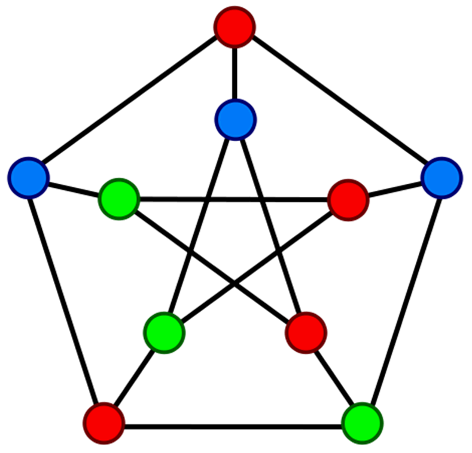

<!-- PROJECT LOGO -->
<br />
<h3 align="center">Politecnico di Torino</h3>
<h3 align="center">System and device programming</h3>
<h3 align="center">Academic year 2020/21</h3>
<h4 align="center">Team members: Cardano Filippo, Finocchiaro Loredana, Gagliardi Giuseppe</h3><br />
<p align="center">
  <a href="https://github.com/Frititati/GraphColoringQ1">
    
  </a>
  
  <h1 align="center">Parallel Graph Coloring</h1>

  <p align="center">
    In graph theory, graph coloring is a special case of graph labeling; in which particular labels, traditionally called “colors”, are assigned to elements of a graph subject to certain constraints.
    <br /> In its simplest form, it is a way of coloring the vertices of a graph such that no two adjacent vertices are of the same color. Graph coloring enjoys many practical applications as well as theoretical challenges. Many graph applications are based on vertex coloring and many graph properties are based on graph coloring. Moreover, vertex coloring is the most famous version of coloring since other coloring problems can be transformed into a vertex coloring instance.
    <br /><br />
    <a href="https://github.com/Frititati/GraphColoringQ1"><strong>Explore the docs »</strong></a>
    <br />
    <br />
  </p>
</p>


<!-- TABLE OF CONTENTS -->
<details open="open">
  <summary><h2 style="display: inline-block">Table of Contents</h2></summary>

- [Abstract](#abstract)
- [Folders organization](#folders-organization)
- [Program execution](#program-execution)
  + [Prerequisites](#prerequisites)
	+ [Coloring algorithms](#coloring-algorithms)
      + [Sequential](#sequential)
      + [Parallel](#parallel)
	+ [Tester](#tester) 

- [Development details](#development-details)
  + [Jones-Plassman](#jones-plassman)
  + [Largest Degree First](#largest-degree-first)
- [Performance tests](#performance-tests)
- [Conclusions](#conclusions)

</details>
<br />

# Abstract
<br />

# Folders organization

Here's a blank template to get started:
**To avoid retyping too much info. Do a search and replace with your text editor for the following:**
`github_username`, `repo_name`, `twitter_handle`, `email`, `project_title`, `project_description`
<br />


# Program execution

To get a local copy up and running follow these simple steps.

## Prerequisites

1. Clone the repo
   ```sh
   git clone https://github.com/Frititati/GraphColoringQ1
   ```


## Coloring algorithms
### Sequential
### Parallel

## Tester

# Development details

## Jones-Plassman

## Largest Degree First

# Performance tests

# Conclusions

## References

Project Link: [https://github.com/Frititati/GraphColoringQ1](https://github.com/Frititati/GraphColoringQ1)
